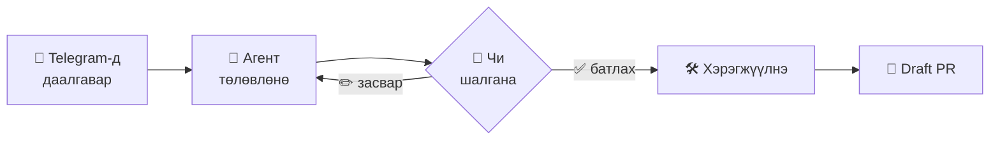
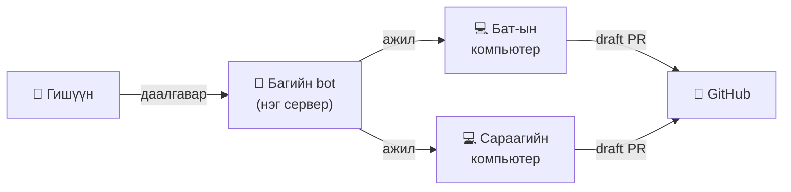

<div align="center">

# 🚀 Dispatch

**Telegram-д даалгавар бич → Claude Code, Codex эсвэл Gemini төлөвлөнө → чи батал → draft PR бэлэн.**


**Монгол** · [English](README.en.md)

</div>

---

## 🔁 Яаж ажилладаг вэ



Агент **таны өөрийн компьютер** дээр, **таны** Claude Code / Codex / Gemini болон GitHub эрхээр ажиллана. Dispatch өөрөө ямар ч cloud үйлчилгээ шаардахгүй.

## ✨ Боломжууд

| | |
|---|---|
| 📝 **Даалгавар** | Bot-д бичээд төсөл, чухал зэргээ (🔴 🟡 🟢) товчоор сонгоно |
| 🧠 **Туслах** | Энгийн мессежээр асуу: «#12 яагаад унасан бэ?» — хариулж, дараагийн алхмыг товчоор санал болгоно |
| ❓ **Асуулт** | Төлөвлөгөөнд эргэлзээ байвал асууна — товчоор, өөрийн үгээр эсвэл «🤷 Та шийд» |
| ✂️ **Салгах** | Олон даалгавартай нэг мессежийг тус тусад нь хуваана |
| 🗑 **Даалгавар биш** | Даалгавар биш мессежийн (жишээ нь таныг дурдсан асуулт) ноорогийг хаана |
| 🖼 **Хавсралт** | Screenshot, файлыг агент уншина |
| 👥 **Групп** | `@bot` эсвэл хөгжүүлэгчийг mention хийхэд даалгавар үүснэ — менежер ч өгч болно |
| 🔗 **Группт нэмэх** | Төслийн холбоосоор bot-ыг группт нэмэхэд шууд холбогдоно. Нэг төсөл — олон групп |
| 📱 **Mini App** | Чатын **Удирдах** товчоор: даалгавар, төсөл, тохиргоо, лог, гарын авлага |
| 🤖 **Олон агент** | Төсөл бүр өөрийн агенттай: Claude Code, Codex эсвэл Gemini CLI — `--agent codex` эсвэл Mini App-ын **Агент** мөр |
| 💻 **Баг** | Хүн бүрийн даалгавар өөрийнх нь компьютер дээр ажиллана |

## ⚡ 3 алхамаар эхлэх

**Хэрэгтэй:** Java 25+, git, `gh auth login`, мөн нэвтэрсэн агент: [Claude Code](https://claude.ai/code) (`claude`), [Codex](https://github.com/openai/codex) (`codex login`) эсвэл [Gemini CLI](https://github.com/google-gemini/gemini-cli) (`gemini`). ✂️ салгах, туслах нь зөвхөн Claude Code дээр.

**1️⃣ Суулгах**

```sh
# macOS, Linux
curl -fsSL https://raw.githubusercontent.com/astvision/dispatch/main/install.sh | sh
```

```powershell
# Windows (PowerShell)
irm https://raw.githubusercontent.com/astvision/dispatch/main/install.ps1 | iex
```

> Repo private байх үед: `gh api -H "Accept: application/vnd.github.raw" repos/astvision/dispatch/contents/install.sh | sh`

**2️⃣ Тохируулах** — [@BotFather](https://t.me/BotFather)-оос `/newbot`-оор bot үүсгээд:

```sh
dispatch init      # эсвэл: dispatch ui — хөтөч дээр, QR кодтой
```

Ганцаараа эсвэл багаар · bot token · хүмүүс · Claude Code · төслүүд — алхам алхмаар асууж, background-д ажиллуулна.

**3️⃣ Хэрэглэх** — bot-д даалгавраа бич. Болоо! 🎉

## 💬 Командууд

| Команд | Юу хийх |
|---|---|
| энгийн мессеж | Туслахтай ярилцана |
| `/task текст` | Шинэ даалгавар (`/task alm Нэвтрэлтийг засах`) |
| **Зөвшөөрөх** / хариу бичих | Төлөвлөгөөг батлах / засвар өгөх |
| үр дүнд хариу бичих | Нэмэлт ажил — нэг PR-т шинэ commit |
| `/status` · `/history` · `/stats` | Юу явж байна · дууссан · тоо баримт |
| `/retry N` · `/cancel N` | Дахин оролдох · цуцлах |
| `/projects` | Төслүүд ба «➕ Группт нэмэх» холбоос |
| `/manage` эсвэл **Удирдах** товч | Mini App нээх |
| `/new` | Туслахтай шинэ яриа |

**Группт:** `/task@bot текст` эсвэл `@bot текст` · хэн нэгнийг `@username` гэж дурдахад тэр хүнд даалгавар очно · мессежид 👀 → ✍ → 👍/👎 гэж хариу өгнө.

## 👥 Багаар ашиглах



- Нэг машин дээр `dispatch init` → **My team**. Шинэ хүн bot-д бичихэд админ Telegram дээр **зөвшөөрнө**.
- Гишүүн бүр өөрийн компьютер дээр: `/worker` → код авч `dispatch worker init`.
- Код, Claude session, нууц мэдээлэл багийн сервер рүү **хэзээ ч** очихгүй.

## 🛠 Удирдах

```sh
dispatch check              # юу буруу байгааг хэлнэ
dispatch service status     # start · stop · install · uninstall
dispatch project add ~/work/crm
dispatch project add ~/work/api --agent codex   # эсвэл gemini
dispatch ui                 # хөтөч дээр: төсөл, хүмүүс, тохиргоо, лог
```

> 💡 Төсөл бүрт богино `CLAUDE.md` (build, test команд, дүрэм) байвал агент хурдан, хямд ажиллана.

## 🔐 Аюулгүй байдал

> [!WARNING]
> Bot-д хандах эрх = тухайн машины shell-д хандах эрх. Суулгахаасаа өмнө [SECURITY.md](SECURITY.md)-г уншаарай.

Нууц мэдээлэл зөвхөн эзэмшигч уншдаг файлд · лог, мессежээс нууцыг нууна · групп дотор гишүүн бус хүнд чимээгүй.

## 📚 Дэлгэрэнгүй

- 📖 [Бүрэн гарын авлага (English)](README.en.md) — багийн сервер, systemd, Mini App, ажиллуулах
- 🏗 [Архитектур](docs/ARCHITECTURE.md) · 🧭 [Шийдвэрүүд (ADR)](docs/adr/) · 📘 [Нэр томьёо](CONTEXT.md)

**Build:** `./mvnw verify` · UI-тай: `(cd ui && npm ci && npm run build) && ./mvnw -Pui verify`

<div align="center">

MIT License · Made with ☕ in 🇲🇳

</div>
