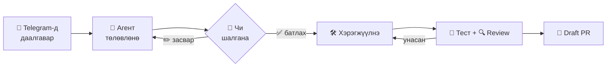
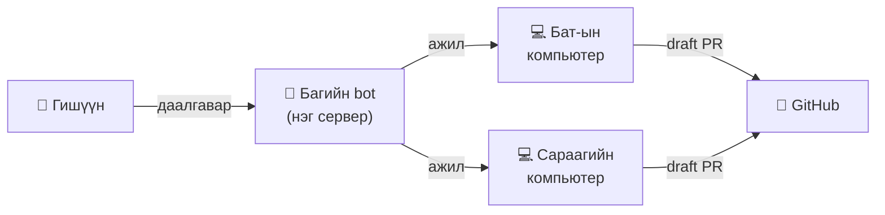

<div align="center">

# 🚀 Dispatch

**Telegram-д даалгавар бич → Claude Code, Codex эсвэл Gemini төлөвлөнө → чи батал → draft PR бэлэн.**


**Монгол** · [English](README.en.md)

</div>

---

## 🔁 Яаж ажилладаг вэ


```mermaid
flowchart LR
    A["💬 Telegram-д<br/>даалгавар"] --> B["🧠 Агент<br/>төлөвлөнө"]
    B --> C{"👀 Чи<br/>шалгана"}
    C -- "✏️ засвар" --> B
    C -- "✅ батлах" --> D["🛠 Хэрэгжүүлнэ"]
    D --> V["🧪 Тест + 🔍 Review"]
    V -- "унасан" --> D
    V --> E["🔀 Draft PR"]
```

Агент **таны өөрийн компьютер** дээр, **таны** Claude Code / Codex / Gemini болон GitHub эрхээр ажиллана. Dispatch өөрөө ямар ч cloud үйлчилгээ шаардахгүй.

## ✨ Боломжууд

| | |
|---|---|
| 📝 **Даалгавар** | Bot-д бичээд **✅ Илгээх** дарна: төсөл (нэрлэсэн, цорын ганц эсвэл сүүлд ашигласан), чухал зэрэг 🟢. **⚙️ Дэлгэрэнгүй**-гээр төсөл, чухал зэргийг (🔴 🟡 🟢) сольно; тэр мессежид хариулж нэмэлт мэдээлэл, файл өгнө |
| 🧠 **Туслах** | Энгийн мессежээр асуу: «#12 яагаад унасан бэ?» — хариулж, дараагийн алхмыг товчоор санал болгоно |
| ❓ **Асуулт** | Төлөвлөгөөнд эргэлзээ байвал асууна — товчоор, өөрийн үгээр эсвэл «🤷 Та шийд» |
| ✂️ **Салгах** | Олон даалгавартай нэг мессежийг тус тусад нь хуваана |
| 🗑 **Даалгавар биш** | Даалгавар биш мессежийн (жишээ нь таныг дурдсан асуулт) ноорогийг хаана |
| 🖼 **Хавсралт** | Screenshot, файлыг агент уншина |
| 👥 **Групп** | `@bot` эсвэл хөгжүүлэгчийг mention хийхэд даалгавар үүснэ — менежер ч өгч болно |
| 🔗 **Группт нэмэх** | Төслийн холбоосоор bot-ыг группт нэмэхэд шууд холбогдоно. Нэг төсөл — олон групп |
| 📱 **Mini App** | Чатын **Удирдах** товчоор: даалгавар, төсөл, тохиргоо, лог, гарын авлага |
| 🖥 **Хөтөч** | `dispatch ui`: тойм, даалгавар, төсөл, хүмүүс, тохиргоо, лог — монгол эсвэл англиар (дээд буланд **Монгол / English**). Даалгавар өгөх, батлах, хариулах, цуцлах, мэдэгдэл авах нь бот ажиллаж байхад. Компьютер дээрх Telegram-ын Mini App-аас **Вэб UI нээх** дарвал нэвтэрсэн байдлаар шууд нээгдэнэ |
| 🤖 **Олон агент** | Төсөл бүр өөрийн агенттай: Claude Code, Codex эсвэл Gemini CLI — `--agent codex` эсвэл Mini App-ын **Агент** мөр |
| 💻 **Баг** | Хүн бүрийн даалгавар өөрийнх нь компьютер дээр ажиллана |
| 🧪 **Шалгалт** | Хэрэгжүүлсний дараа Dispatch тестийг өөрөө ажиллуулж, унасныг агентад засуулна (3 хүртэл удаа), дараа нь шинэ review хийлгэнэ. Үр дүн нь PR дээр бичигдэнэ |
| 🔒 **Sandbox** | Linux дээр агент бүр bubblewrap дотор: зөвхөн өөрийн worktree-д бичнэ, `~/.ssh`, `gh`, Dispatch-ийн нууцыг харахгүй |
| 🧩 **Skills** | Claude-ийн ажилд шалгагдсан skill-үүд ачаалагдана: ажилладаг хамгийн энгийн өөрчлөлт (ponytail), эхлээд унах тест (TDD), алдааны үндсэн шалтгааныг олох, дуусгахаасаа өмнө шалгах, review-ийн жагсаалт. Орхисон зүйлсээ дүгнэлтэд `skipped:` мөрөөр бичнэ. Төлөвлөгөө, гүйцэтгэл бүрт «Speed matters» — хурдан ажилла. `skills: off` (instance эсвэл төсөл) skill-үүдийг унтраана. Өөрийн plugin, MCP сервер, ~/.claude/skills доторх skill-үүдийг dispatch.yaml-ийн agents.claude-code-д (plugins, mcpServers, skills), worker.yaml-д (claudePlugins, claudeMcpServers, claudeSkills) жагсааж болно; ажил бүр жагсаалтыг дахин уншина (ADR 0036). |
| 🔌 **Plugin** | Төлөвлөгөө ажилд хэрэгтэй албан ёсны plugin-ийг жагсаалтаас сонгоно (`frontend-design`, `playwright`, `context7`); хэрэгжүүлэлт ба review тэдгээрийг юу ч суулгалгүй ачаална |
| 🚀 **Teleport** | `dispatch teleport N` — даалгаврын агентын яриаг terminal-д үргэлжлүүлнэ (Claude Code) |

## ⚡ 3 алхамаар эхлэх

**Хэрэгтэй:** Java 25+, git, `gh auth login`, мөн нэвтэрсэн агент: [Claude Code](https://claude.ai/code) (`claude`), [Codex](https://github.com/openai/codex) (`codex login`) эсвэл [Gemini CLI](https://github.com/google-gemini/gemini-cli) (`gemini`). ✂️ салгах, туслах нь зөвхөн Claude Code дээр. Claude Code 2.1.76+.
Linux: агентыг sandbox-д ажиллуулахын тулд `bubblewrap` суулгана уу (`sandbox: off` унтраана).

**1️⃣ Суулгах**

```sh
# macOS, Linux
curl -fsSL https://raw.githubusercontent.com/astvision/dispatch/main/install.sh | sh
```

```powershell
# Windows (PowerShell)
irm https://raw.githubusercontent.com/astvision/dispatch/main/install.ps1 | iex
```

> Repo private байх үед: `gh api -H "Accept: application/vnd.github.raw" repos/astvision/dispatch/contents/install.sh | sh`

**2️⃣ Тохируулах** — [@BotFather](https://t.me/BotFather)-оос `/newbot`-оор bot үүсгээд:

```sh
dispatch init      # эсвэл: dispatch ui — хөтөч дээр, QR кодтой
```

Ганцаараа эсвэл багаар · bot token · хүмүүс · Claude Code · төслүүд — алхам алхмаар асууж, background-д ажиллуулна.

**3️⃣ Хэрэглэх** — bot-д даалгавраа бич. Болоо! 🎉

## 💬 Командууд

| Команд | Юу хийх |
|---|---|
| энгийн мессеж | Туслахтай ярилцана |
| `/task текст` | Шинэ даалгавар (`/task alm Нэвтрэлтийг засах`) |
| **Зөвшөөрөх** / хариу бичих | Төлөвлөгөөг батлах / засвар өгөх |
| үр дүнд хариу бичих | Нэмэлт ажил — нэг PR-т шинэ commit |
| үр дүнгийн **🔀 Нэгтгэх** | PR-ийг squash-merge хийнэ (хувийн bot). Нэгтгэсний дараах хариу шинэ даалгавар болно |
| `/status` · `/history` · `/stats` | Юу явж байна · дууссан · тоо баримт |
| `/retry N` · `/cancel N` | Дахин оролдох · цуцлах |
| `/projects` | Төслүүд ба «➕ Группт нэмэх» холбоос |
| `/manage` эсвэл **Удирдах** товч | Mini App нээх |
| `/teleport N` | Даалгаврын агентын яриаг terminal-д үргэлжлүүлэх команд (`dispatch teleport N`) |
| `/new` | Туслахтай шинэ яриа |

**Группт:** `/task@bot текст` эсвэл `@bot текст` · хэн нэгнийг `@username` гэж дурдахад тэр хүнд даалгавар очно · мессежид 👀 → ✍ → 👍/👎 гэж хариу өгнө.

## 🧭 Ажлын алхам ба удирдлага

Mini App-д даалгаврыг нээхэд гүйцэтгэл алхам алхмаар харагдана (ажиллаж байх үед 2 секунд тутам шинэчлэгдэнэ): алхам бүрийн төлөв, хугацаа, агентын сүүлийн үйлдэл, эцэст нь зардал.

| Алхам | Юу болдог |
|---|---|
| 🧠 Төлөвлөлт | Агент кодыг уншаад төлөвлөгөө гаргана (зөвхөн уншина) — чи батална |
| 🛠 Хэрэгжүүлэлт | Агент өөрийн worktree-д өөрчлөлтөө хийнэ |
| 🧪 Тест N | Dispatch төслийн `test:` командыг өөрөө ажиллуулна (10 мин хүртэл). Унасан бол сүүлийн мөрүүд нь доор нь харагдана |
| 🔧 Засвар N/3 | Унасан тестийг агентад буцааж засуулна — 3 хүртэл удаа |
| ⏸ Review-ийн өмнө зогссон | ⏸ асаалттай бол тестийн дараа таны шийдвэрийг хүлээнэ |
| 🔍 Review | Шинэ, зөвхөн уншдаг reviewer өөрчлөлтийг төлөвлөгөөтэй тулгана; олдворууд ач холбогдлоор |
| 📦 Хүргэх | Commit, push, draft PR — юу тэнцсэн, унасан, алгассаныг PR дээр бичнэ |

Dispatch үргэлж хүргэнэ: тест унасан ч PR нь тэмдэглэгээтэйгээр очно, шийдвэр чинийх.

**Удирдлага** (зөвхөн даалгавар өгсөн хүн, гүйцэтгэл явж байхад):

| Товч | Юу хийх |
|---|---|
| ⏭ **…-г алгасах** | Явж буй тест, засвар эсвэл review-г алгасна; давталт үргэлжилнэ, PR дээр «алгассан» гэж бичигдэнэ |
| 📦 **Одоо хүргэх** | Явж буй алхмыг зогсоож, өөр юу ч ажиллуулахгүйгээр шууд хүргэнэ |
| ⏸ **Review-ийн өмнө зогсоох** | Тестийн дараа хүлээнэ: 🔍 **Review хийх** эсвэл 📦 **Review-гүй хүргэх**; 15 минут хариу өгөхгүй бол review өөрөө эхэлнэ. Зогссон хугацаа гүйцэтгэлийн хугацаанд тооцогдохгүй |
| 🚀 **Teleport** | Зогссон эсвэл дууссан үед: агентын яриаг terminal-д үргэлжлүүлэх команд (`dispatch teleport N`), хуулах товчтой |
| **Цуцлах** | Даалгаврыг цуцална (`/cancel N`) |

`loop: off` (instance эсвэл төсөл) тест, засвар, review-г бүхэлд нь унтраана.

## 👥 Багаар ашиглах


```mermaid
flowchart LR
    T["👤 Гишүүн"] -- "даалгавар" --> S["🤖 Багийн bot<br/>(нэг сервер)"]
    S -- "ажил" --> W1["💻 Бат-ын<br/>компьютер"]
    S -- "ажил" --> W2["💻 Сараагийн<br/>компьютер"]
    W1 & W2 -- "draft PR" --> G["🐙 GitHub"]
```

- Нэг машин дээр `dispatch init` → **My team**. Шинэ хүн bot-д бичихэд админ Telegram дээр **зөвшөөрнө**.
- Гишүүн бүр өөрийн компьютер дээр: `/worker` → код авч `dispatch worker init`.
- Код, Claude session, нууц мэдээлэл багийн сервер рүү **хэзээ ч** очихгүй.

## 🛠 Удирдах

```sh
dispatch check              # юу буруу байгааг хэлнэ
dispatch service status     # start · stop · install · uninstall
dispatch project add ~/work/crm
dispatch project add ~/work/api --agent codex   # эсвэл gemini
dispatch ui                 # хөтөч дээр: даалгавар, төсөл, хүмүүс, тохиргоо, лог
dispatch teleport 13        # #13-ийн Claude session-г terminal-д; --plan бол төлөвлөгөөний session
```

> 💡 Төсөл бүрт богино `CLAUDE.md` (build, test команд, дүрэм) байвал агент хурдан, хямд ажиллана.

> 🧪 `test: <команд>` — гүйцэтгэл бүрийн дараа Dispatch ажиллуулж, унасан бол агентад буцааж засуулна; `loop: off` (instance эсвэл төсөл) тест ба review-ийн давталтыг унтраана.

### Нэг компьютер дээр өөр нэг bot

`dispatch init`-ийг дахин ажиллуулаарай: эхний bot-оо олоод хажууд нь өөрийг нь санал болгоно, жишээ нь хувийн
bot-ынхоо хажууд багийн bot. Хоёр дахь нь өөрийн нэр, config, state болон background service-тэй; `dispatch list`
бүгдийг харуулна. Хоёр дахийг нь `--instance NAME`-ээр аль ч командад зааж болно: `dispatch check --instance team`,
`dispatch service status --instance team`, `dispatch ui --instance team`. Түүний даалгаврын branch-ууд
`dispatch/team/<task>` тул хоёр bot нэг clone дээр зэрэг ажиллаж болно.

### Linux дээрх Telegram Desktop-д Mini App нээгдэхгүй бол

«Webview crashed» гарах эсвэл Mini App хулганаа аваачих хүртэл харагдахгүй бол Telegram X11/XWayland дээр ажиллаж байна (WebKitGTK зурж чадахгүй). Wayland-д шилжүүлээд Telegram-аа бүрэн хааж дахин нээгээрэй:

```sh
flatpak override --user --socket=wayland org.telegram.desktop
```

Утас, macOS, Windows дээр ийм асуудал гарахгүй.

## 🔐 Аюулгүй байдал

> [!WARNING]
> Bot-д хандах эрх = тухайн машины shell-д хандах эрх. Суулгахаасаа өмнө [SECURITY.md](SECURITY.md)-г уншаарай.

Нууц мэдээлэл зөвхөн эзэмшигч уншдаг файлд · лог, мессежээс нууцыг нууна · групп дотор гишүүн бус хүнд чимээгүй.

## 📚 Дэлгэрэнгүй

- 📖 [Бүрэн гарын авлага (English)](README.en.md) — багийн сервер, systemd, Mini App, ажиллуулах
- 🏗 [Архитектур](docs/ARCHITECTURE.md) · 🧭 [Шийдвэрүүд (ADR)](docs/adr/) · 📘 [Нэр томьёо](CONTEXT.md)

**Build:** `./mvnw verify` · UI-тай: `(cd ui && npm ci && npm run build) && ./mvnw -Pui verify`

<div align="center">

MIT License · Made with ☕ in 🇲🇳

</div>
